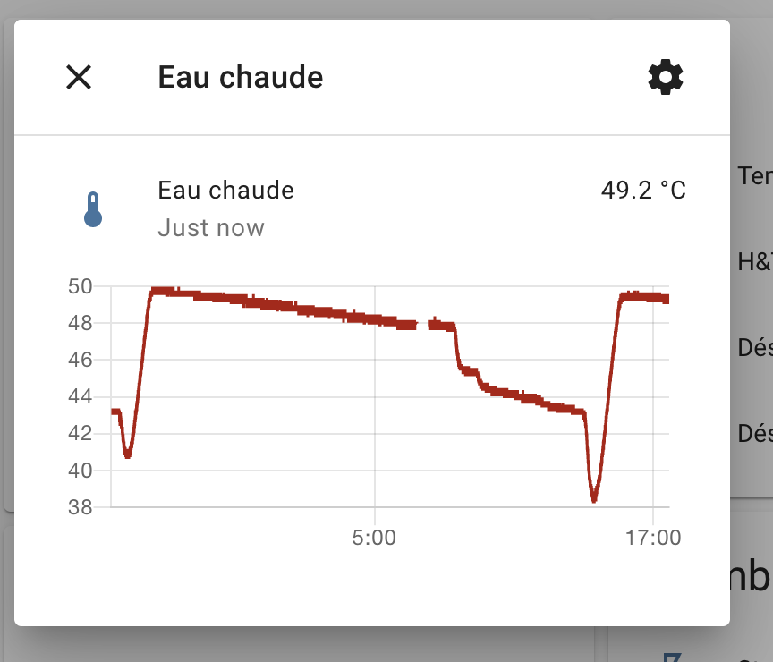

Hoval Gateway Demo
==================

This repository contains a sample file demonstrating how to parse the data flowing through the Hoval CAN bus used by Hoval heaters and other appliances from Hoval.

Not everything is recognized (only <8 bytes messages are parsed, longer is not yet supported). Moreover we only listen on message ID 0x1FC00FFF. Which means if your setup has different device / address this needs to be adapted.

Setup required
--------------

1. Raspberry PI
2. CAN Transceiver and adapter (for example from Alibaba or Wish..)

1. Modify your CAN adapter and wire it to the Raspberry PI by following https://www.raspberrypi.org/forums/viewtopic.php?t=141052
2. Connect the CAN adapter to the H,L and ground lines of your Hoval appliance. Depending on the appliance it requires opening up the panel with the screen. Behind it there are a lot of connectors. One of them is labelled 'CAN bus'. You can connect your 3 wires (H, L and ground) there.
3. Flash the latest Debian version on your Raspberry PI
4. In your PI, open /boot/config.txt and add:
    ```
    dtoverlay=mcp2515-can0,oscillator=8000000,interrupt=12
    ```
5. Install the can-utils, and python3 if not installed:
    ```
    sudo apt-get install -y can-utils python3
    ```
6. Setup the CAN adpater to be up at boot time with 50kbps that matches Hoval CAN bus speed:
    ```
    echo "ip link set can0 up type can bitrate 50000" >> /etc/rc.local
    ```
7. Reboot the PI


Hoval GW Python script
----------------------

The python script opens the `can0` device on the PI, listen for some of the datapoints and report them to MQTT server specified at the begining of the file. You need to adapt the following variable from the `hoval-gw.py` file so that it matches your MQTT broker (for example using home-assistant):

```py
# Change this to match your Home-Assistant / MQTT broker
broker = '192.168.0.96' # IP of MQTT / Home-assistant MQTT
broker_username = "hoval"
broker_password = "hoval"
```

And then run it:
```
python3 hoval-gw.py
```

You can then configure home assistant with for example:
```yaml
sensor:
  - platform: mqtt
    state_topic: "hoval-gw/Eau chaude réelle SF"
    unique_id: "hoval-gw-eau"
    name: "Eau chaude"
    unit_of_measurement: °C
```

This way you will get the following in your home assistant instance:

